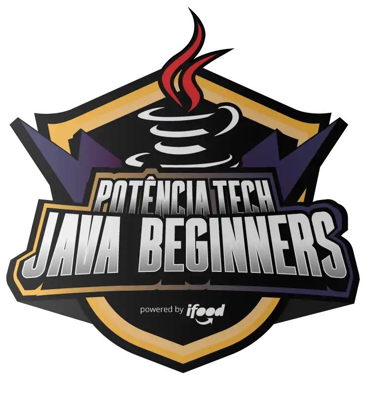

<h1>Potência Tech powered by iFood - Java Beginners</h1>

Estudo da linguagem Java - Básico: bootcamp concluído em 25/11/22 ✅

BootCamp Java Beginners: Jornada de 91hrs com anatomia da linguagem java, fundamentos, criando sistemas, jogos, programação orientada a objetos, explorando a linguagem. ✅

Com imersão no Carreira Tech em 23/11 ingressando na One Oracle Next Education com formação back-end em Java e Banco de dados.

 
